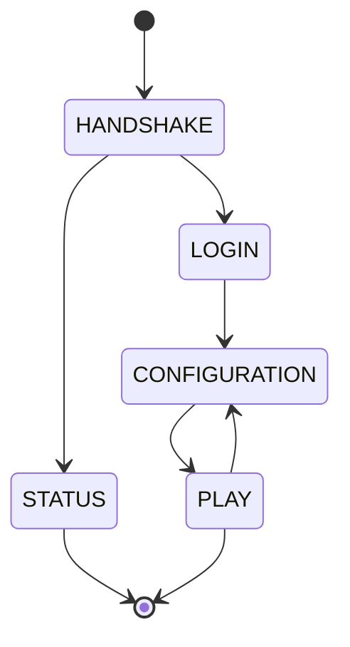

The connection system manages the lifecycle of client-server connections, tracking state transitions and handling network events.

## ConnectionManager

The `ConnectionManager` class handles client connections.

```java
package com.wirethread.network.connection;

public final class ConnectionManager {
}
```

<Note>
  The ConnectionManager implementation is currently minimal. Connection state is tracked using Netty channel attributes.
</Note>

### Channel attributes

Connection state is stored in Netty channel attributes:

- `CLIENT_CONNECTION_STATE_KEY` - Current connection state
- `CONNECTION_MANAGER_KEY` - Connection manager instance

## Connection states

The `ConnectionState` enum defines the stages of a client-server connection.

```java
public enum ConnectionState {
    HANDSHAKE,
    STATUS,
    LOGIN,
    CONFIGURATION,
    PLAY;
}
```

<ResponseField name="HANDSHAKE">
  Default state before any packet is received. The client initiates the connection.
</ResponseField>

<ResponseField name="STATUS">
  Client declares STATUS intent during handshake. Used for server list ping.
</ResponseField>

<ResponseField name="LOGIN">
  Client declares LOGIN intent during handshake. Begins authentication.
</ResponseField>

<ResponseField name="CONFIGURATION">
  Client acknowledged login and is configuring the game. Can transition back from PLAY.
</ResponseField>

<ResponseField name="PLAY">
  Client finished configuration and is in active gameplay.
</ResponseField>

### State transitions

The connection state machine allows these transitions:



<Info>
  The STATUS state is terminal - after status queries, the connection closes.
  
  The PLAY ↔ CONFIGURATION transition allows dynamic reconfiguration without disconnecting.
</Info>

## Connection intention

During handshake, the client declares its `ConnectionIntention`.

```java
public enum ConnectionIntention {
    STATUS(1),
    LOGIN(2),
    TRANSFER(3);

    private final int identifier;
}
```

<ParamField path="STATUS" type="int" default="1">
  Query server status (ping)
</ParamField>

<ParamField path="LOGIN" type="int" default="2">
  Begin login sequence
</ParamField>

<ParamField path="TRANSFER" type="int" default="3">
  Transfer from another server
</ParamField>

### Methods

<ResponseField name="getIntention" type="ConnectionIntention">
  Static method to retrieve a ConnectionIntention from its ID (1-3)
  
  ```java
  public static ConnectionIntention getIntention(final int id) {
      return switch (id) {
          case 1 -> STATUS;
          case 2 -> LOGIN;
          case 3 -> TRANSFER;
          default -> throw new IllegalArgumentException("Illegal connection intention");
      };
  }
  ```
  
  <ParamField path="id" type="int" required>
    Integer between 1 and 3
  </ParamField>
</ResponseField>

<ResponseField name="getIntentionId" type="int">
  Returns the identifier of this intention
  
  ```java
  public int getIntentionId() {
      return identifier;
  }
  ```
</ResponseField>

## Handler adapters

Handler adapters process inbound and outbound network events using Netty's pipeline architecture.

### InboundHandlerAdapter

Handles incoming packets from clients.

```java
public final class InboundHandlerAdapter extends ChannelInboundHandlerAdapter {
    
    @Override
    public void channelRead(ChannelHandlerContext ctx, Object msg) throws Exception {
        if (!ctx.channel().isActive()) return;
        
        final ConnectionManager connectionManager = 
            ctx.channel().attr(CONNECTION_MANAGER_KEY).get();
    }
    
    @Override
    public void exceptionCaught(ChannelHandlerContext ctx, Throwable cause) {
        // Exception handling
    }
}
```

<ParamField path="channelRead">
  Called when a packet is received from the client
  
  <ParamField path="ctx" type="ChannelHandlerContext">
    Netty channel context
  </ParamField>
  
  <ParamField path="msg" type="Object">
    The decoded packet object
  </ParamField>
</ParamField>

#### Exception handling

The adapter catches and logs specific exception types:

- `PacketFormatException` - Invalid packet structure
- `PacketPayloadException` - Invalid packet data
- `InboundDecoderException` - Decoder failure
- `IOException` - Network I/O error

### OutboundHandlerAdapter

Handles outgoing packets to clients.

```java
public final class OutboundHandlerAdapter extends ChannelOutboundHandlerAdapter {
    
    @Override
    public void read(ChannelHandlerContext ctx) throws Exception {
        super.read(ctx);
    }
    
    @Override
    public void write(ChannelHandlerContext ctx, Object msg, ChannelPromise promise) 
            throws Exception {
        super.write(ctx, msg, promise);
    }
}
```

<ParamField path="write">
  Called when a packet is sent to the client
  
  <ParamField path="ctx" type="ChannelHandlerContext">
    Netty channel context
  </ParamField>
  
  <ParamField path="msg" type="Object">
    The packet to encode and send
  </ParamField>
  
  <ParamField path="promise" type="ChannelPromise">
    Promise for write completion
  </ParamField>
</ParamField>

### InboundTerminalHandlerAdapter

Special handler for terminal packets that close the connection.

<Note>
  Terminal packets have `isTerminal()` returning true, signaling the connection should close after processing.
</Note>

### SwitchingProtocolsHandlerAdapter

Handles protocol state transitions during the connection lifecycle.

## Usage example

### Accessing connection state

```java
// Get current connection state from channel
ConnectionState state = channel.attr(CLIENT_CONNECTION_STATE_KEY).get();

if (state == ConnectionState.HANDSHAKE) {
    // Process handshake
}
```

### Transitioning states

```java
// Transition from LOGIN to CONFIGURATION
channel.attr(CLIENT_CONNECTION_STATE_KEY).set(ConnectionState.CONFIGURATION);
```

### Handling connection intentions

```java
// Parse intention from handshake packet
int intentionId = handshakePacket.intention().getIntentionId();

ConnectionState nextState = switch (handshakePacket.intention()) {
    case STATUS -> ConnectionState.STATUS;
    case LOGIN -> ConnectionState.LOGIN;
    case TRANSFER -> ConnectionState.LOGIN;
};

channel.attr(CLIENT_CONNECTION_STATE_KEY).set(nextState);
```

## See also

- [Packets](/api/network/packets) - Packet interface and types
- [Codecs](/api/network/codecs) - Packet encoding and decoding
