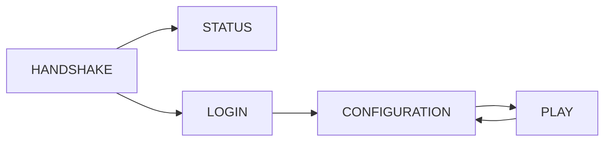

The Network module provides the core infrastructure for client-server communication in Wirethread. It handles packet transmission, connection management, and protocol state transitions.

## Architecture

The network module is built on top of Netty and provides:

- **Packet system** - Type-safe packet definitions with serialization
- **Connection management** - State machine for connection lifecycle
- **Codec pipeline** - Encoding and decoding of network data
- **Handler adapters** - Inbound and outbound message processing

## Key components

<CardGroup cols={2}>
  <Card title="Packets" icon="box" href="/api/network/packets">
    Packet interface, bounds, and packet types
  </Card>
  <Card title="Connections" icon="link" href="/api/network/connections">
    Connection states, manager, and adapters
  </Card>
  <Card title="Codecs" icon="code" href="/api/network/codecs">
    Packet encoders and decoders
  </Card>
</CardGroup>

## Package structure

The network module is organized into the following packages:

```
com.wirethread.network
├── channels/          # Netty channel initialization
├── codecs/            # Packet encoders and decoders
├── connection/        # Connection management
│   └── adapters/      # Netty handler adapters
├── packet/            # Packet definitions
│   ├── client/        # Client-bound packets
│   └── server/        # Server-bound packets
└── types/             # Primitive type serializers
```

## Connection flow

A typical connection follows this state progression:



1. **HANDSHAKE** - Initial connection state
2. **STATUS** - Server status query (ping)
3. **LOGIN** - Authentication and player login
4. **CONFIGURATION** - Game configuration exchange
5. **PLAY** - Active gameplay

## Usage example

```java
// Define a packet
public record LoginStartPacket(
    @NotNull String playerName,
    @NotNull UUID playerId
) implements ServerBoundPacket.Login {
    public static final Type<LoginStartPacket> SERIALIZER = new Type<>() {
        @Override
        public LoginStartPacket read(@NotNull ByteBuf buffer) throws IOException {
            return new LoginStartPacket(
                Primitives.STRING.read(buffer),
                Primitives.UUID_TYPE.read(buffer)
            );
        }
    };
}
```

## Related modules

- **wirethread-core** - Core exceptions and utilities
- **wirethread-server** - Server implementation using this network layer
