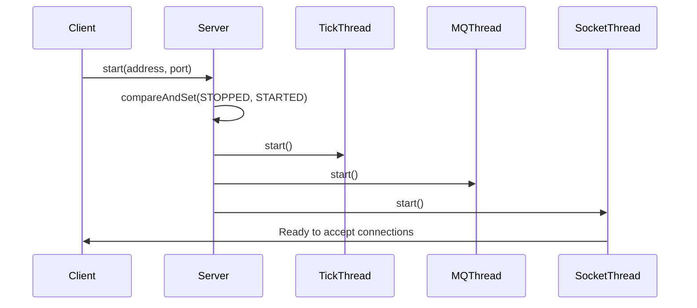
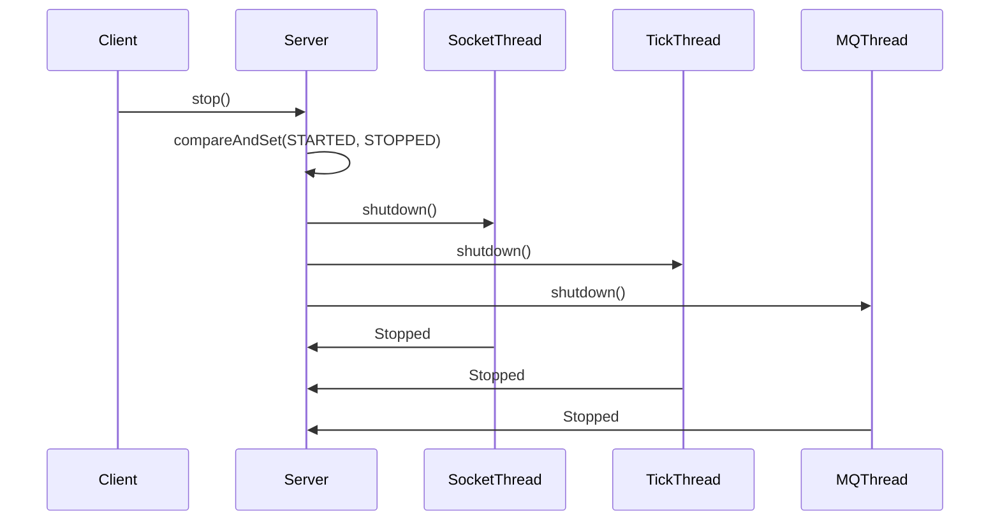

The Wirethread server follows a simple but strict lifecycle with two primary states and atomic transitions between them.

## Server states

The server can be in one of two states, defined in the `State` enum:

### `STARTED`

The server is actively running and accepting connections. In this state:
- All three server threads are running
- Clients can connect to the server
- Game ticks are being processed
- Message queue is operational

### `STOPPED`

The server has been shut down or has not yet started. In this state:
- All server threads are stopped
- No connections are accepted
- No game processing occurs

## State definition

```java
package com.wirethread.server;

public enum State {
    STARTED(true),
    STOPPED(false);

    public final boolean value;

    State(boolean value) {
        this.value = value;
    }
}
```

## Lifecycle transitions

The server uses atomic compare-and-set operations to ensure thread-safe state transitions.

### Startup sequence



**Code example:**

```java
public void start(@NotNull SocketAddress socketAddress) {
    // Atomic state transition - fails if not STOPPED
    if (!this.serverState.compareAndSet(State.STOPPED, State.STARTED)) {
        throw new IllegalStateException("Server already started.");
    }

    LOGGER.info("Starting {} server.", this.getServerBrandName());

    var exceptionManager = this.serverProcess.exceptionManager();
    final ConnectionManager connectionManager = this.serverProcess.connectionManager();

    try {
        // Start threads in order
        this.tickWorker = new TickServerThread(exceptionManager);
        this.tickWorker.start();

        this.mqWorker = new MQServerThread(exceptionManager, connectionManager);
        this.mqWorker.start();

        this.socketWorker = new SocketServerThread(exceptionManager, connectionManager, socketAddress);
        this.socketWorker.start();

    } catch (Exception exc) {
        exceptionManager.handleException(exc);
    }
}
```

Source: `Server.java:92`

### Shutdown sequence



**Code example:**

```java
public void stop() {
    // Atomic state transition - fails if not STARTED
    if (!this.serverState.compareAndSet(State.STARTED, State.STOPPED)) {
        throw new IllegalStateException("Server already stopped.");
    }

    var exceptionManager = this.serverProcess.exceptionManager();

    try {
        // Shutdown threads in order
        this.socketWorker.shutdown();
        this.tickWorker.shutdown();
        this.mqWorker.shutdown();

    } catch (Exception exc) {
        exceptionManager.handleException(exc);
        throw new RuntimeException(exc);
    }
}
```

Source: `Server.java:132`

## Thread-safe state management

The server uses `AtomicReference<State>` to ensure thread-safe state access:

```java
protected final AtomicReference<State> serverState;

// In constructor
this.serverState = new AtomicReference<>(State.STOPPED);
```

This allows multiple threads to safely check the server state:

```java
State currentState = server.getServerStatus();
if (currentState == State.STARTED) {
    // Perform operations that require a running server
}
```

## Error handling

The lifecycle methods include robust error handling:

### Illegal state transitions

Both `start()` and `stop()` will throw `IllegalStateException` if called when the server is already in the target state:

```java
// Attempting to start an already running server
try {
    server.start("localhost", 25565);
    server.start("localhost", 25565); // Throws IllegalStateException
} catch (IllegalStateException e) {
    // "Server already started."
}
```

### Exception propagation

Exceptions during startup are caught and handled by the `ExceptionManager`:

```java
try {
    this.tickWorker = new TickServerThread(exceptionManager);
    this.tickWorker.start();
    // ...
} catch (Exception exc) {
    exceptionManager.handleException(exc);
}
```

Exceptions during shutdown are both handled and re-thrown:

```java
try {
    this.socketWorker.shutdown();
    // ...
} catch (Exception exc) {
    exceptionManager.handleException(exc);
    throw new RuntimeException(exc);
}
```

## Best practices

### Check state before operations

```java
if (server.getServerStatus() == State.STOPPED) {
    server.start("0.0.0.0", 25565);
}
```

### Clean shutdown

Always ensure the server is properly stopped before the application exits:

```java
Runtime.getRuntime().addShutdownHook(new Thread(() -> {
    if (server.getServerStatus() == State.STARTED) {
        server.stop();
    }
}));
```

### Single start/stop

The server is designed for a single start-stop cycle. After stopping, create a new server instance rather than attempting to restart:

```java
// Create server
Server server = new MyServer();
server.start("localhost", 25565);

// Later...
server.stop();

// Do NOT restart the same instance
// server.start("localhost", 25565); // Possible issues

// Instead, create a new instance
server = new MyServer();
server.start("localhost", 25565);
```