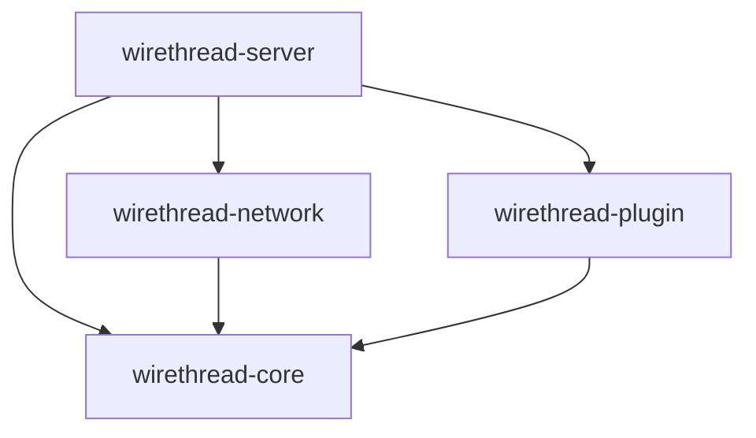

Wirethread is built on a modular architecture that separates concerns into distinct modules, each responsible for specific functionality. This design promotes maintainability, testability, and extensibility.

## Module overview

The framework consists of four primary modules:

<CardGroup cols={2}>
  <Card title="wirethread-core" icon="cube">
    Core game logic, registries, and resource management
  </Card>
  <Card title="wirethread-network" icon="network-wired">
    Netty-based networking, packet handling, and protocol implementation
  </Card>
  <Card title="wirethread-plugin" icon="puzzle-piece">
    Plugin system and extension interfaces
  </Card>
  <Card title="wirethread-server" icon="server">
    Server implementation, thread management, and process coordination
  </Card>
</CardGroup>

## Core module

The `wirethread-core` module contains fundamental game logic and abstractions:

### Manager pattern

Wirethread uses a manager-based architecture for resource coordination. All managers implement the `Manager` interface:

```java
package com.wirethread.core;

/**
 * Represents a software component which is responsible for the management
 * of server resources.
 */
public interface Manager {
}
```

Key managers include:

- **WorldManager** - World and dimension management
- **BlockManager** - Block state and behavior
- **RecipeManager** - Crafting recipes
- **TeamManager** - Player teams and scoreboards
- **AdvancementManager** - Player achievements
- **BossBarManager** - Boss bar displays

### Server process

The `ServerProcess` record aggregates all managers for centralized access:

```java
public record ServerProcess(
    WorldManager worldManager,
    BlockManager blockManager,
    CommandManager commandManager,
    RecipeManager recipeManager,
    TeamManager teamManager,
    GlobalEventManager globalEventManager,
    SchedulerManager schedulerManager,
    AdvancementManager advancementManager,
    BossBarManager bossBarManager,
    ConnectionManager connectionManager,
    BenchmarkManager benchmarkManager,
    ExceptionManager exceptionManager
) {}
```

## Network module

The `wirethread-network` module handles all client-server communication using Netty.

<Note>
  Wirethread implements the Minecraft protocol using a custom packet serialization system with type-safe codecs.
</Note>

### Key components

- **ClientChannelInitializer** - Sets up the Netty pipeline for each connection
- **InboundPacketDecoder** - Deserializes incoming packets
- **OutboundPacketEncoder** - Serializes outgoing packets
- **ConnectionManager** - Tracks active client connections
- **Packet registries** - Maps packet IDs to implementations

See [Networking](/concepts/networking) for detailed information.

## Plugin module

The `wirethread-plugin` module provides the extension system. It defines the core `Pluggable` interface that all plugins must implement.

See [Plugin system](/concepts/plugin-system) for more details.

## Server module

The `wirethread-server` module ties everything together:

### Thread architecture

Wirethread uses dedicated threads for different responsibilities:

- **SocketServerThread** - Handles incoming client connections
- **TickServerThread** - Runs the game tick loop
- **MQServerThread** - Message queue processing

### Server class

The `Server` class coordinates the entire server lifecycle:

```java
public abstract class Server {
    protected final AtomicReference<State> serverState;
    protected volatile ServerProcess serverProcess;
    protected volatile DynamicRegistries serverRegistries;
    private volatile StaticRegistries staticRegistries;
    
    public void start(SocketAddress socketAddress) {
        // Initialize threads and bind socket
    }
    
    public void stop() {
        // Shutdown all threads gracefully
    }
}
```

## Dependency flow

The modules follow a clear dependency hierarchy:



- `wirethread-core` has no dependencies on other Wirethread modules
- `wirethread-network` depends on `wirethread-core` for namespaces and exceptions
- `wirethread-plugin` depends on `wirethread-core` for namespace support
- `wirethread-server` orchestrates all modules

## Design principles

<AccordionGroup>
  <Accordion title="Separation of concerns">
    Each module has a distinct responsibility. Networking code doesn't handle game logic, and core logic doesn't manage connections.
  </Accordion>
  
  <Accordion title="Immutability where possible">
    Records like `ServerProcess`, `StaticRegistries`, and `DynamicRegistries` are immutable containers that prevent accidental state mutations.
  </Accordion>
  
  <Accordion title="Thread safety">
    Shared state uses `AtomicReference` and `volatile` keywords. Each server thread has dedicated responsibilities to minimize contention.
  </Accordion>
  
  <Accordion title="Extensibility">
    The plugin system and manager pattern allow developers to extend functionality without modifying core code.
  </Accordion>
</AccordionGroup>

## Next steps

<CardGroup cols={2}>
  <Card title="Plugin system" icon="puzzle-piece" href="/concepts/plugin-system">
    Learn how to extend Wirethread with plugins
  </Card>
  <Card title="Registries" icon="database" href="/concepts/registries">
    Understand resource registration and management
  </Card>
  <Card title="Namespaces" icon="tag" href="/concepts/namespaces">
    Explore resource identification and organization
  </Card>
  <Card title="Networking" icon="network-wired" href="/concepts/networking">
    Dive into packet handling and protocols
  </Card>
</CardGroup>