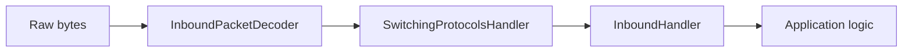

Wirethread uses [Netty](https://netty.io/) as its networking foundation, providing a high-performance, asynchronous I/O framework for handling client-server communication. The network layer implements the Minecraft protocol with custom packet serialization and a flexible handler pipeline.

## Network architecture overview

The network module (`wirethread-network`) handles all aspects of client-server communication:

<CardGroup cols={2}>
  <Card title="Connection management" icon="link">
    Track and manage client connections
  </Card>
  <Card title="Packet serialization" icon="binary">
    Encode and decode Minecraft protocol packets
  </Card>
  <Card title="Protocol handling" icon="handshake">
    Implement handshake, status, login, and play protocols
  </Card>
  <Card title="Channel pipeline" icon="pipe">
    Process packets through customizable handlers
  </Card>
</CardGroup>

## Server initialization

The `SocketServerThread` manages the Netty server bootstrap:

```java
package com.wirethread.server.thread;

import com.wirethread.network.channels.ClientChannelInitializer;
import com.wirethread.network.connection.ConnectionManager;
import io.netty.bootstrap.ServerBootstrap;
import io.netty.channel.ChannelOption;
import io.netty.channel.EventLoopGroup;
import io.netty.channel.nio.NioEventLoopGroup;
import io.netty.channel.socket.nio.NioServerSocketChannel;

public final class SocketServerThread extends ServerThread {
    
    private final EventLoopGroup inboundGroup = new NioEventLoopGroup(1);
    private final EventLoopGroup handlerGroup = new NioEventLoopGroup(
        new CustomThreadFactory("client")
    );
    private final ConnectionManager connectionManager;
    
    @Override
    public void run() {
        final ServerBootstrap bootstrap = new ServerBootstrap()
            .group(inboundGroup, handlerGroup)
            .channel(NioServerSocketChannel.class)
            .localAddress(serverSocketAddress)
            .childOption(ChannelOption.SO_KEEPALIVE, true)
            .childHandler(new ClientChannelInitializer(connectionManager));

        final ChannelFuture f = bootstrap.bind().sync();
        f.channel().closeFuture().sync();
    }
    
    @Override
    public void shutdown() {
        this.inboundGroup.shutdownGracefully();
        this.handlerGroup.shutdownGracefully();
    }
}
```

### Event loop groups

Wirethread uses two event loop groups:

1. **Inbound group**: Single-threaded, accepts new connections
2. **Handler group**: Multi-threaded, processes client packets

<Info>
  This separation ensures that accepting new connections doesn't block packet processing.
</Info>

## Channel initialization

Each client connection gets its own channel with a configured pipeline:

```java
package com.wirethread.network.channels;

import com.wirethread.network.codecs.InboundPacketDecoder;
import com.wirethread.network.connection.ConnectionState;
import com.wirethread.network.connection.adapters.InboundHandlerAdapter;
import com.wirethread.network.connection.adapters.SwitchingProtocolsHandlerAdapter;
import io.netty.channel.ChannelInitializer;
import io.netty.channel.socket.SocketChannel;

public final class ClientChannelInitializer extends ChannelInitializer<SocketChannel> {
    
    private final ConnectionManager connectionManager;
    
    @Override
    protected void initChannel(SocketChannel ch) throws Exception {
        // Set initial connection state
        ch.attr(CLIENT_CONNECTION_STATE_KEY).set(ConnectionState.HANDSHAKE);
        ch.attr(CONNECTION_MANAGER_KEY).set(connectionManager);
        
        // Configure pipeline
        ch.pipeline()
            .addLast("inbound_packet_decoder", new InboundPacketDecoder())
            .addLast("switching_protocols_handler", 
                     new SwitchingProtocolsHandlerAdapter())
            .addLast("inbound_packet_handler", new InboundHandlerAdapter());
    }
}
```

### Handler pipeline

Packets flow through the pipeline in order:



1. **InboundPacketDecoder**: Deserializes raw bytes into packet objects
2. **SwitchingProtocolsHandler**: Manages protocol state transitions
3. **InboundHandler**: Routes packets to appropriate handlers

## Packet decoding

The `InboundPacketDecoder` transforms byte buffers into packet objects:

```java
package com.wirethread.network.codecs;

import com.wirethread.network.connection.ConnectionState;
import com.wirethread.network.packet.PacketFormat;
import com.wirethread.network.packet.PacketHolder;
import com.wirethread.network.packet.PacketRegistry;
import com.wirethread.network.packet.server.ServerPacketRegistry;
import io.netty.buffer.ByteBuf;
import io.netty.channel.ChannelHandlerContext;
import io.netty.handler.codec.ByteToMessageDecoder;

public final class InboundPacketDecoder extends ByteToMessageDecoder {
    
    @Override
    protected void decode(ChannelHandlerContext ctx, ByteBuf buffer, 
                         List<Object> out) throws Exception {
        if (!buffer.isReadable()) return;
        
        // 1. Get current connection state
        final ConnectionState clientConnectionState = 
            ctx.channel().attr(CLIENT_CONNECTION_STATE_KEY).get();
        final PacketRegistry<?> packetRegistry = 
            ServerPacketRegistry.DEFAULT_REGISTRY.getRegistryOf(clientConnectionState);
        
        // 2. Read packet format (ID and length)
        final PacketFormat packetFormat = PacketFormat.SERIALIZER.read(buffer);
        final PacketHolder<?> packetType = packetRegistry.get(packetFormat.packetId());
        
        if (packetType == null) {
            throw new IllegalResourceException(
                "Missing packet registry.", packetFormat.packetId());
        }
        
        // 3. Deserialize packet
        final Packet packet = packetType.type().read(buffer);
        
        if (packet == null) {
            throw new InboundDecoderException(
                "The packet deserialized returned null.");
        }
        
        // 4. Add to output for next handler
        out.add(packet);
    }
}
```

### Packet lifecycle

<Steps>
  <Step title="Read packet format">
    Extract packet ID and length from the byte buffer
  </Step>
  
  <Step title="Lookup packet type">
    Find the packet implementation in the registry based on ID and connection state
  </Step>
  
  <Step title="Deserialize packet">
    Use the packet's type-specific deserializer to read remaining data
  </Step>
  
  <Step title="Pass to next handler">
    Add the packet object to the pipeline for processing
  </Step>
</Steps>

## Connection states

The Minecraft protocol has distinct states:

```java
public enum ConnectionState {
    HANDSHAKE,  // Initial connection
    STATUS,     // Server list ping
    LOGIN,      // Authentication
    PLAY        // In-game
}
```

Each state has its own packet registry:

<Tabs>
  <Tab title="Handshake">
    - **HandshakePacket**: Client sends protocol version and intent (status or login)
    - **LegacyPingPacket**: Support for old server list ping format
  </Tab>
  
  <Tab title="Status">
    - **StatusRequestPacket**: Request server information
    - **StatusResponsePacket**: Server sends MOTD, player count, version
    - **PingRequestPacket**: Latency measurement
    - **PongResponsePacket**: Ping response
  </Tab>
  
  <Tab title="Login">
    - **LoginStartPacket**: Client sends username
    - **EncryptionRequestPacket**: Server requests encryption
    - **EncryptionResponsePacket**: Client responds with encrypted key
    - **LoginSuccessPacket**: Authentication complete
    - **SetCompressionPacket**: Enable packet compression
  </Tab>
  
  <Tab title="Play">
    All in-game packets (movement, chat, block updates, etc.)
  </Tab>
</Tabs>

## Packet handling

The `InboundHandlerAdapter` processes decoded packets:

```java
package com.wirethread.network.connection.adapters;

import com.wirethread.network.connection.ConnectionManager;
import com.wirethread.network.packet.Packet;
import io.netty.channel.ChannelHandlerContext;
import io.netty.channel.ChannelInboundHandlerAdapter;

public final class InboundHandlerAdapter extends ChannelInboundHandlerAdapter {
    
    @Override
    public void channelRead(ChannelHandlerContext ctx, Object msg) throws Exception {
        // Return if channel is not active
        if (!ctx.channel().isActive()) return;
        
        final ConnectionManager connectionManager = 
            ctx.channel().attr(CONNECTION_MANAGER_KEY).get();
        
        // Handle packet based on type
        // (Implementation routes to specific packet handlers)
    }
    
    @Override
    public void exceptionCaught(ChannelHandlerContext ctx, Throwable cause) {
        switch (cause) {
            case PacketFormatException e -> 
                LOGGER.error("A packet format exception was caught.", e);
            case PacketPayloadException e -> 
                LOGGER.error("A packet payload exception was caught.", e);
            case InboundDecoderException e -> 
                LOGGER.error("Panic at the inbound packet decoder.", e);
            case IOException e -> 
                LOGGER.error("An IO exception was caught.", e);
            default -> 
                LOGGER.error("Unhandled exception was caught.", cause);
        }
    }
}
```

## Packet interface

All packets implement the `Packet` interface:

```java
package com.wirethread.network.packet;

import com.wirethread.network.connection.ConnectionState;
import org.jetbrains.annotations.NotNull;

public interface Packet {
    
    /**
     * Returns the bound of this packet.
     */
    @NotNull
    PacketBound getBound();
    
    /**
     * Returns the current state of this packet.
     */
    @NotNull
    ConnectionState getConnectionState();
    
    /**
     * Retrieves whether this packet is a terminal packet.
     * Terminal packets close the connection after processing.
     */
    default boolean isTerminal() {
        return false;
    }
}
```

### Packet bounds

Packets can be:
- **SERVER_BOUND**: Client → Server
- **CLIENT_BOUND**: Server → Client

## Type system

Wirethread includes a type system for packet serialization:

```java
package com.wirethread.network.types;

// Primitive types
public class VarIntType implements Type<Integer> { ... }
public class VarLongType implements Type<Long> { ... }
public class StringType implements Type<String> { ... }
public class UUIDType implements Type<UUID> { ... }

// Complex types
public class Vector3DType implements Type<Vector3D> { ... }
public class QuaternionType implements Type<Quaternion> { ... }
```

These types handle the Minecraft protocol's specific encodings:

<Info>
  VarInt and VarLong use variable-length encoding to save bandwidth for small numbers.
</Info>

## Connection management

The `ConnectionManager` tracks active connections:

```java
package com.wirethread.network.connection;

/**
 * Handles the client connection.
 */
public final class ConnectionManager {
    // Track active connections
    // Manage connection lifecycle
    // Handle disconnections
}
```

## Custom packet example

Creating a custom packet:

```java
import com.wirethread.network.packet.Packet;
import com.wirethread.network.packet.PacketBound;
import com.wirethread.network.connection.ConnectionState;
import com.wirethread.network.types.StringType;
import com.wirethread.network.types.VarIntType;
import io.netty.buffer.ByteBuf;

public class CustomDataPacket implements Packet {
    private final String message;
    private final int value;
    
    public CustomDataPacket(String message, int value) {
        this.message = message;
        this.value = value;
    }
    
    @Override
    public PacketBound getBound() {
        return PacketBound.SERVER_BOUND;
    }
    
    @Override
    public ConnectionState getConnectionState() {
        return ConnectionState.PLAY;
    }
    
    // Serialization
    public void write(ByteBuf buffer) {
        StringType.INSTANCE.write(buffer, message);
        VarIntType.INSTANCE.write(buffer, value);
    }
    
    // Deserialization
    public static CustomDataPacket read(ByteBuf buffer) {
        String message = StringType.INSTANCE.read(buffer);
        int value = VarIntType.INSTANCE.read(buffer);
        return new CustomDataPacket(message, value);
    }
}
```

## Best practices

<AccordionGroup>
  <Accordion title="Handle exceptions gracefully">
    Always catch and log exceptions in handlers. Unhandled exceptions can crash the server or disconnect clients unexpectedly.
  </Accordion>
  
  <Accordion title="Validate packet data">
    Never trust client data. Validate all packet contents before processing to prevent exploits.
  </Accordion>
  
  <Accordion title="Use appropriate thread pools">
    Keep blocking operations off the Netty event loop. Use separate executors for database queries or file I/O.
  </Accordion>
  
  <Accordion title="Implement proper cleanup">
    Release ByteBuf instances and clean up resources to prevent memory leaks.
  </Accordion>
  
  <Accordion title="Monitor connection state">
    Always check connection state before sending packets. Some packets are only valid in specific states.
  </Accordion>
</AccordionGroup>

## Network exceptions

Wirethread defines custom exceptions for network errors:

```java
// Core exceptions
com.wirethread.core.exceptions.network.ChannelException
com.wirethread.core.exceptions.network.InboundDecoderException
com.wirethread.core.exceptions.network.PacketFormatException
com.wirethread.core.exceptions.network.PacketPayloadException
com.wirethread.core.exceptions.network.SwitchingProtocolsException
```

These exceptions help identify specific networking issues during debugging.

## Performance considerations

<CardGroup cols={2}>
  <Card title="Zero-copy operations" icon="bolt">
    Netty's ByteBuf uses direct memory and zero-copy techniques for optimal performance
  </Card>
  
  <Card title="Async I/O" icon="arrows-rotate">
    Non-blocking I/O prevents thread starvation under high load
  </Card>
  
  <Card title="Connection pooling" icon="layer-group">
    Event loops efficiently handle thousands of concurrent connections
  </Card>
  
  <Card title="Packet compression" icon="file-zipper">
    Automatic compression for packets above threshold reduces bandwidth
  </Card>
</CardGroup>

## Next steps

<CardGroup cols={2}>
  <Card title="Architecture" icon="sitemap" href="/concepts/architecture">
    Understand how networking fits into the overall framework
  </Card>
  <Card title="Registries" icon="database" href="/concepts/registries">
    Learn about packet registry system
  </Card>
  <Card title="Plugin system" icon="puzzle-piece" href="/concepts/plugin-system">
    Extend networking with custom packet handlers
  </Card>
</CardGroup>